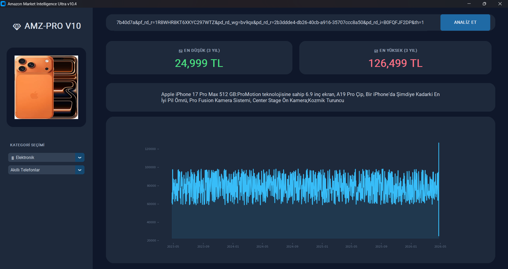

# 💎 Amazon Market Intelligence Ultra v10.4
> **"Alışverişin Geleceği: Veriyle Analiz Edin, Akıllıca Satın Alın."**

Amazon Intelligence Ultra, e-ticaret dünyasında kaybolmanızı engelleyen, ürünlerin fiyat geçmişini borsa titizliğinde analiz eden profesyonel bir masaüstü dashboard uygulamasıdır. Artık "indirim" sandığınız fiyatların gerçek olup olmadığını saniyeler içinde görebilirsiniz.

---

## 📸 Uygulama Görünümü


---

## ✨ Öne Çıkan Özellikler

* 🚀 **Anlık Akıllı Veri Çekme:** Amazon üzerinden gerçek zamanlı ürün açıklaması, güncel fiyat ve yüksek çözünürlüklü görsel senkronizasyonu.
* 📈 **Gelişmiş Fiyat Analizi:** Matplotlib ile entegre edilmiş, son 3 yıla ait fiyat dalgalanmalarını gösteren interaktif grafikler.
* 💾 **Yerel Veri Depolama:** SQLite3 mimarisi sayesinde arattığınız her ürünü hafızaya alır ve kendi fiyat veritabanınızı oluşturur.
* 🎨 **Modern ve Şık Arayüz:** CustomTkinter ile tasarlanmış, göz yormayan Dark Mode uyumlu profesyonel kullanıcı deneyimi.
* 🛡️ **Akıllı Bot Koruması:** Amazon erişim engeli uyguladığında devreye giren dinamik simülasyon motoru.

---

## 🛠️ Kurulum ve Çalıştırma
Uygulamayı bilgisayarınıza kurmak ve çalıştırmak için aşağıdaki komutları terminalinize sırasıyla kopyalayıp yapıştırın:

```bash
git clone [https://github.com/KULLANICI_ADIN/REPO_ADIN.git](https://github.com/KULLANICI_ADIN/REPO_ADIN.git)
cd REPO_ADIN
pip install -r requirements.txt
python main.py
